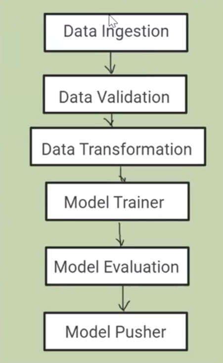

# Air Pressure system Sensor Component Failure Prediction

### Step 1 - Install the requirements

```bash
pip install -r requirements.txt
```

### Step 2 - Run main.py file

```bash
python main.py
```


To download your dataset

```
wget https://raw.githubusercontent.com/avnyadav/sensor-fault-detection/main/aps_failure_training_set1.csv
```

## Pipeline
