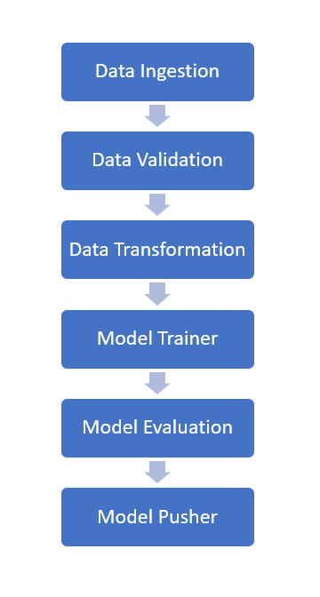

# Air Pressure System Sensor Component Failure Prediction

### Step 1 - Install the requirements

```bash
pip install -r requirements.txt
```

### Step 2 - Run main.py file

```bash
python main.py
```

To download dataset

```
wget https://raw.githubusercontent.com/avnyadav/sensor-fault-detection/main/aps_failure_training_set1.csv
```

## Pipeline



# Deployment 

## Create AWS User Using IAM
* Add new user & give username
* Select AWS credential type = Access key - Programmatic access
* Add permission - 
  * AmazonEC2ContainerRegistryFullAccess
  * AmazonEC2FullAccess
* Download and save user credential csv file.

## Create Elastic Container Registry (ECR)
* Create new ECR repo
* Copy ECR URI

## Create S3 Bucket
* Create new S3 bucket


## Prepare EC2 instance
### Create EC2 instance
### Install docker

Run following commands on Ec2 instance to install Docker

```bash
curl -fsSL https://get.docker.com -o get-docker.sh
sudo sh get-docker.sh
sudo usermod -aG docker ubuntu
newgrp docker
```
## Add github Runner to EC2
### Create new runner in github

* Goto Github Repo -> under settings-> actions-> runner

- Run Linux commands to create self-hosted runner on Ec2 similar to below

### Attach github runner to EC2 instance 

* Copy code from github runner similar to below mention & run on EC2.
#### Download
```bash
# Create a folder
$ mkdir actions-runner && cd actions-runner# Download the latest runner package
$ curl -o actions-runner-linux-x64-2.299.1.tar.gz -L https://github.com/actions/runner/releases/download/v2.299.1/actions-runner-linux-x64-2.299.1.tar.gz# Optional: Validate the hash
$ echo "147c14700c6cb997421b9a239c012197f11ea9854cd901ee88ead6fe73a72c74  actions-runner-linux-x64-2.299.1.tar.gz" | shasum -a 256 -c# Extract the installer
$ tar xzf ./actions-runner-linux-x64-2.299.1.tar.gz
```

#### Configure
```bash
# Create the runner and start the configuration experience
$ ./config.sh --url https://github.com/digvijaytaunk/aps-fault-detection-with-deployment --token AD7ALDRQDZ4Z3WWTINCMU7DDUV7TS# Last step, run it!
$ ./run.sh
```

#### Using your self-hosted runner

```bash
# Use this YAML in your workflow file for each job
runs-on: self-hosted
```
#### Output
The information to be provided while creating runner is -

``` bash
# Runner Registration

Enter the name of the runner group to add this runner to: [press Enter for Default]

Enter the name of runner: [press Enter for ip-172-31-33-92] self-hosted

This runner will have the following labels: 'self-hosted', 'Linux', 'X64'
Enter any additional labels (ex. label-1,label-2): [press Enter to skip]

√ Runner successfully added
√ Runner connection is good

# Runner settings

Enter name of work folder: [press Enter for _work]

√ Settings Saved.

ubuntu@ip-172-31-33-92:~/actions-runner$
```

After setting up the runner. Enter below command to start the runner

```bash
./run.sh
```

## GutHub Action Secrets
### Create secrets
```python
AWS_REGION = ap-south-1
ECR_REPOSITORY_NAME = aps-fault-ecr
AWS_ECR_LOGIN_URI = 936373932582.dkr.ecr.ap-south-1.amazonaws.com
AWS_ACCESS_KEY_ID = 
AWS_SECRET_ACCESS_KEY = 
BUCKET_NAME = aps-fault-bucket
MONGO_DB_URL = 
```
